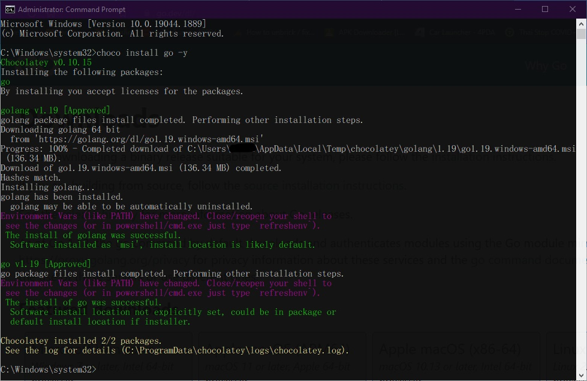
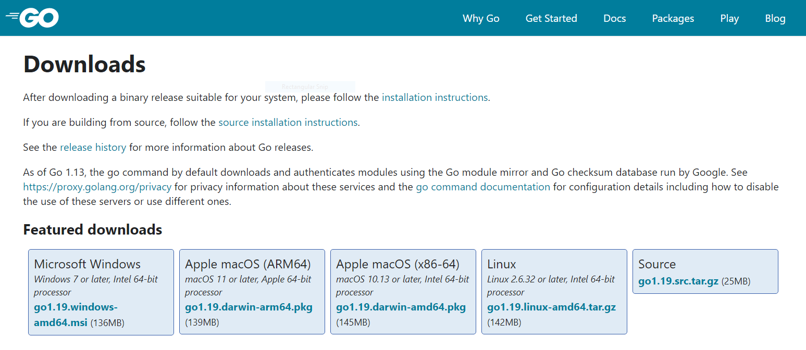
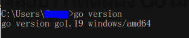
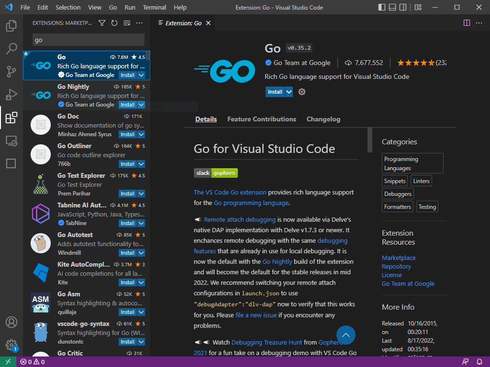
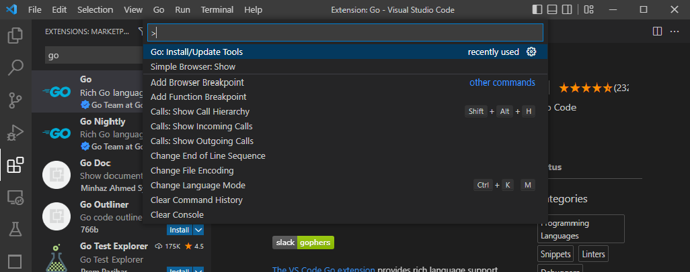
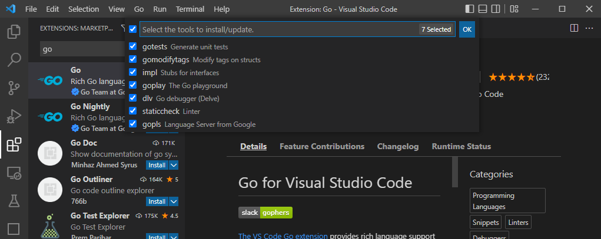
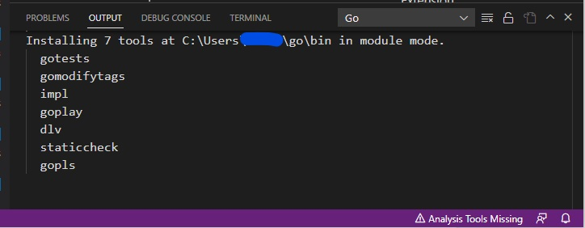
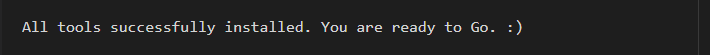

### เครื่องมือที่จำเป็น

เมื่อจะเริ่มพัฒนาโปรแกรมด้วยภาษา Go เราจำเป็นต้องจัดเตรียมเครื่องมือเครื่องใช้ให้ครบถ้วนเสียก่อน สำหรับเครื่องมือที่จำเป็นหลัก ๆ ก็จะมีดังต่อไปนี้

* Go
* VS Code (หรือ IDE อื่น ๆ ผู้บันทึกเลือกใช้ตัวนี้)
* Git
* Go Extension & Tools for VS Code

### Installing Go <a href="#installing-go" id="installing-go"></a>

ติดตั้ง Go compiler, tools and library

สำหรับ Windows ที่มีการติดตั้ง [`Chocolatey`][choco] ไว้แล้ว สามารถติดตั้ง Go ผ่านคอมมานด์ไลน์ ด้วยคำสั่ง `choco` ได้เลย

เปิดหน้าต่าง `cmd.exe` ในโหมด `Administrator` พิมพ์คำสั่ง

```
choco install go -y
```

[choco]: ../others/chocolatey-package-manager-for-windows.md

สถานะการติดตั้ง ก็จะเป็นประมาณแบบนี้

<figure><figcaption><p>choco install go -y</p></figcaption></figure>

แต่ถ้าไม่ได้ติดตั้ง `Chocolatey` ก็สามารถไปดาวน์โหลดไฟล์ติดตั้งโดยตรงจาก [Go Download](https://go.dev/dl)&#x20;

<figure><figcaption><p>https://go.dev/dl</p></figcaption></figure>

โดยเลือกสถาปัตยกรรมให้ตรงกับเครื่องที่เราใช้งานได้เลย

หลังจากติดตั้ง Go เสร็จแล้ว ให้ตรวจสอบผลการติดตั้งในหน้าต่าง `cmd.exe` พิมพ์คำสั่ง

```shell
go version
```

<figure><figcaption><p>go version checking</p></figcaption></figure>

ถ้าบรรทัดคำสั่งแสดงหมายเลข version ออกมา แสดงว่าการติดตั้ง Go เสร็จเรียบร้อย&#x20;


### Installing VS Code <a href="#installing-vs-code" id="installing-vs-code"></a>

เช่นกันสำหรับ Windows ที่มี `Chocolatey` ก็สามารถลงด้วยคำสั่ง

```
choco install vscode -y
```

ถ้าไม่มี `Chocolatey` ก็ไปโหลดมาจากเว็บ [VS Code](https://code.visualstudio.com/download) ได้โดยตรงเช่นเดียวกัน อย่าลืมเลือกสถาปัตยกรรมให้ตรงกับเครื่องที่เราใช้งาน

### Installing Git <a href="#installing-git" id="installing-git"></a>

สามารถใช้คำสั่ง `Chocolatey` ติดตั้งได้เลย

```
choco install git -y
```

ถ้าไม่มี `Chocolatey` ก็ไปโหลดมาจากเว็บ [Git](https://git-scm.com/downloads) ได้โดยตรงเช่นเดียวกัน

### Installing Go Extension & Tools for VS Code <a href="#installing-go-extension--tools-for-vs-code" id="installing-go-extension--tools-for-vs-code"></a>

เปิด VS Code ขึ้นมาแล้วกดไปที่แท็ป Extension ในช่องค้นหา พิมพ์ `Go`\
แล้วเลือกแพกเกจ Go ที่เป็นของ `Google` กดปุ่ม `install` ในหน้าต่างแพกเกจได้เลย

<figure><figcaption><p>Select Go Extension</p></figcaption></figure>

เสร็จแล้ว กด `Ctrl` + `Shift` + `P` แล้วพิมพ์คำสั่งลงไป

```
Go: Install/Update Tools
```

<figure><figcaption><p>Go: Install/Update Tolls</p></figcaption></figure>

กด `Enter` กล่องคำสั่งจะเปลี่ยนเป็นรายการเครื่องมือให้เลือกติดตั้ง แนะนำให้เลือกทั้งหมด\
กดปุ่ม `OK`

<figure><figcaption><p>select the tools to install/update</p></figcaption></figure>

สังเกตุหน้าต่างสถานะของ VS Code จะแสดงรายการติดตั้ง

<figure><figcaption><p>go tools installing status</p></figcaption></figure>

รอจนทุกอย่างขึ้น `SUCCESSED` และปรากฏข้อความนี้

<figure><figcaption><p>All tools installed</p></figcaption></figure>

\
เป็นอันเสร็จเรียบร้อยสำหรับการจัดเตรียมเครื่องมือที่จำเป็น ตอนนี้ก็พร้อมแล้วที่จะพัฒนาโปรแกรมด้วยภาษา Go ซึ่งจะนำมาเล่าต่อในคราวต่อไป 😄

## ความคิดเห็น

[][comment]

[comment]: https://gist.github.com/Komsan74/4febb2167f3a96c379dd756e6c92a200