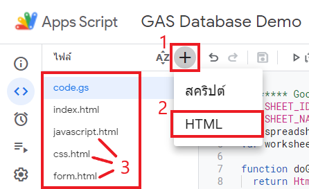

# สร้างฟอร์มบันทึกข้อมูลจากเว็บแอปลงใน Google Sheet ด้วย Google Apps Script

<figure><figcaption></figcaption></figure>

### ขั้นตอน

* **เซิร์ฟเวอร์** เขียนคำสั่ง `Apps Script` ติดต่อกับ `Google Sheet`
* **ไคลเอ็นต์** สร้างฟอร์มสำหรับบันทึกข้อมูล
* **ไคลเอ็นต์-เซิร์ฟเวอร์** เขียนคำสั่ง `Javascript` เพื่อส่งคำสั่งจากเว็บแอปมาติดต่อกับ `Apps Script`

### เซิร์ฟเวอร์ เขียนคำสั่ง Apps Script ติดต่อกับ Google Sheet

ในการสื่อสารกันระหว่างเว็บแอป กับฐานข้อมูล (`google sheet`) เราต้องอาศัยตัวกลางในการเชื่อมต่อ ซึ่งก็คือ Google Apps Script ในที่นี้เราจะถือว่าเป็นสคริปต์ฝั่ง _เซิร์ฟเวอร์_  จากบทบันทึกที่แล้ว เราได้เผยแพร่เว็บแอป Hello, Google Apps Script ออกมา นั่นคือตัวอย่างการสื่อสารกันระหว่าง _ไคลเอ็นต์_ `(index.html)` กับ _เซิร์ฟเวอร์_ `(code.gs)` โดยที่ยังไม่ได้มีการได้เชื่อมต่อกับฐานข้อมูล ซึ่งจะกล่าวถึงในบทบันทึกนี้

#### รายการจำเป็นสำหรับการเชื่อมต่อฐานข้อมูลกูลเกิ้ลชีต

* SHEET\_ID หมายเลขไอดีของสเปรดชีตที่เราต้องการเชื่อมต่อ
* SHEET\_NAME ชื่อแผ่นงานที่เราต้องการเชื่อมต่อ

#### SHEET\_ID&#x20;

หมายเลขไอดีของสเปรดชีตที่เราต้องการเชื่อมต่อ สามารถดูได้จาก _Url_ ที่อยู่ของสเปรดชีต ระหว่าง /d/ กับ /edit#

<figure><figcaption></figcaption></figure>

ดังในรูปตัวอย่าง SHEET\_ID จะเท่ากับ "1dxxxxxxxxxxxxxxxxxxxxlri8" เป็นต้น

#### SHEET\_NAME&#x20;

ชื่อแผ่นงานที่เราต้องการเชื่อมต่อ สำหรับในตัวอย่างนี้ ผู้บันทึกได้ตั้งชื่อแผ่นงานว่า `[tbl]customer`

#### เขียนคำสั่ง Apps Script

ประกาศตัวแปรในการเชื่อมต่อไว้ที่ส่วนหัวของไฟล์ `code.gs` ตามข้อมูลที่เราเตรียมไว้ข้างต้น

```javascript
/******* Google Sheet Connection *******/
var SHEET_ID = '1dCxxxxxxxxxxxxxxxxxxxxxxxxxlri8'; // เปลี่ยนเป็น SHEET_ID ของคุณ
var SHEET_NAME = '[tbl]Customer'; // เปลี่ยนเป็น SHEET_NAME ของคุณ
var spreadsheet = SpreadsheetApp.openById(SHEET_ID);
var worksheet = spreadsheet.getSheetByName(SHEET_NAME);
```

#### คำสั่ง Apps Script บันทึกข้อมูลลงสเปรดชีต

เมื่อประกาศตัวแปรในการเชื่อมต่อเรียบร้อย ต่อมาเป็นการจัดเตรียมชุดคำสั่ง (function) ที่จะส่งข้อมูลจากเซิร์ฟเวอร์ไปบันทึกลงในสเปรดชีตของเรา

#### สิ่งที่ต้องรู้

* ฟิลด์ข้อมูลในสเปรดชีต มี 5 ฟิลด์ คือ **`[id, CCode, CName, CAddress, CPhone]`**
* ตำแหน่งของแถวข้อมูลที่จะทำการบันทึก
* ข้อมูลที่จะส่งไปบันทึก (ต้องมี 5 ฟิลด์เช่นเดียวกัน)

#### ทดลองเขียนคำสั่งทดสอบ

```javascript
function createData() {  
  // ตำแหน่งของแถวข้อมูลที่จะทำการบันทึก
  let new_row = spreadsheet.getLastRow() + 1;
  let last_col = spreadsheet.getLastColumn();
  
  // ข้อมูลที่จะส่งไปบันทึก
  let values = [];
  values.push([Date.now(),"1001", "บริษัท ร่ำรวยมหาศาล จำกัด", "ถนนทรัพย์เศรษฐี", "0123456789"]);
  
  // ดำเนินการบันทึกข้อมูลลงในสเปรดชีต
  worksheet.getRange(new_row, 1, 1, last_col).setValues(values);
}
```

อธิบายเล็กน้อยเกี่ยวกับข้อมูลที่จะส่งไปบันทึก มี 5 ฟิลด์ เราสร้างให้เป็นข้อมูลอาร์เรย์ดังนี้&#x20;

`values = [ [ฟิลด์ 0, ฟิลด์ 1, ฟิลด์ 2, ฟิลด์ 3, ฟิลด์ 4] ]`

* ฟิลด์ 0 = `id` ให้ระบบสร้างให้อัตโนมัติโดยใช้ฟังก์ชั่น `Date.now()`
* ฟิลด์ 1 = `CCode` ในตัวอย่างกำหนดเป็น "1001"
* ฟิลด์ 2 = `CName` ในตัวอย่างกำหนดเป็น "บริษัท ร่ำรวยมหาศาล จำกัด"
* ฟิลด์ 3 = `CAddress` ในตัวอย่างกำหนดเป็น "ถนนทรัพย์เศรษฐี"&#x20;
* ฟิลด์ 4 = `CPhone` ในตัวอย่างกำหนดเป็น "0123456789"

กำหนดแถวและช่วงข้อมูลในสเปรดชีต แล้วใช้ฟังก์ชั่น [`.setValues(อาร์เรย์ข้อมูล)`](https://developers.google.com/apps-script/reference/spreadsheet/range?hl=en#setValues\(Object\))  บันทึกข้อมูลลงไป

เมื่อตรวจสอบความถูกต้องแล้ว ทำการกดบันทึกสคริปต์ แล้วเลือกฟังก์ชั่นทำการทดสอบ

<figure><figcaption></figcaption></figure>

รอจนหน้าต่างบันทึกการดำเนินการ แสดงข้อความว่า ดำเนินการเสร็จแล้ว

<figure><figcaption></figcaption></figure>

ไปตรวจสอบดูในสเปรดชีต จะเห็นว่ามีข้อมูล `บริษัท ร่ำรวยมหาศาล จำกัด` เพิ่มเข้ามา แสดงว่าสคริปต์ที่ทดสอบสามารถใช้งานได้จริง&#x20;

<figure><figcaption></figcaption></figure>

ทำการปรับปรุงฟังก์ชั่น เพื่อให้รองรับข้อมูลที่จะส่งเข้ามาจากฝั่งไคลเอ็นต์ แล้วนำไปบันทึก เมื่อเสร็จเรียบร้อยให้ส่งข้อความตอบกลับไปที่ไคลเอ็นต์ เพื่อแจ้งให้ผู้ใช้ทราบว่า เซิร์ฟเวอร์ได้ดำเนินการตามที่ไคลเอ็นต์ร้องขอเรียบร้อย

#### ปรับปรุงคำสั่ง Apps Script ให้ติดต่อกับไคลเอ็นต์ได้

```javascript
/*************** Create ***************/ 
function createData(data) { // เพิ่มอาร์กิวเม้นต์ data รับค่าที่ส่งมาจากไคลเอ็นต์
    // ตำแหน่งของแถวข้อมูลที่จะทำการบันทึก
    let new_row = spreadsheet.getLastRow() + 1; 
    let last_col = spreadsheet.getLastColumn();
    
    // ข้อมูลที่จะส่งไปบันทึก รับค่ามาจากไคลเอ็นต์ (data)
    let values = []; // ระบุฟิลด์ข้อมูลจากอาร์กิวเม้นต์ที่รับมา data.<element_id>
    values.push([Date.now(),data.ccode, data.cname, data.caddress, data.cphone]);
    worksheet.getRange(new_row, 1, 1, last_col).setValues(values);
    
    // ข้อความส่งกลับเมื่อดำเนินการสำเร็จ
    let result = "บันทึกสำเร็จ"; 
    return result; 
}
```

ฟังก์ชั่น createData(data) รับเอาข้อมูลที่จะส่งไปบันทึกมาจากฝั่งไคลเอ็นต์ ผ่านตัวแปร data เมื่อดำเนินการเสร็จ ก็ส่งข้อความตอบกลับผ่านตัวแปร result ฝั่งไคลเอ็นต์ก็จะรับกลับไปแสดงผลกับผู้ใช้งาน ซึ่งจะกล่าวถึงในขั้นตอนการเขียน Javascript ที่ฝั่งไคลเอ็นต์อีกที

### ไคลเอ็นต์ สร้างฟอร์มสำหรับบันทึกข้อมูล

เมื่อเตรียมชุดคำสั่งบันทึกข้อมูลที่ฝั่งเซิร์ฟเวอร์เสร็จแล้ว ต่อมาก็ทำการสร้างฟอร์มบันทึกข้อมูลลงในหน้าเว็บแอป (index.html) ที่เคยสร้างไว้จากบทบันทึกที่แล้ว ซึ่งในบทบันทึกนี้จะแนะนำให้แยกไฟล์ html ออกเป็นหลายไฟล์ เพื่อแยกโครงสร้างหน้าเว็บออกเป็นส่วน ๆ&#x20;

จริงอยู่ แม้ว่าเราจะสามารถวางโค้ดทุกอย่างทั้ง html, Javascript และ css ไว้ในไฟล์เดียวกันได้ทั้งหมด แต่คงไม่ได้รับความสะดวกนัก หากต้องการที่จะตรวจสอบแก้ไขเพียงส่วนใดส่วนหนึ่งในเว็บแอปของเรา ดังนั้น ผู้บันทึกจึงขอแนะนำให้ทำการแยกไฟล์งานออกเป็นส่วน ๆ ด้วยการ

* เขียนชุดคำสั่ง `include(filename)` ไว้ที่ฝั่งเซิร์ฟเวอร์ หรือ Apps Script
* สร้างไฟล์ `css.html` ไว้เขียนชุดคำสั่งเกี่ยวกับ `css` เพื่อตบแต่งหน้าเว็บ
* สร้างไฟล์ `javascript.html` ไว้เขียนชุดคำสั่ง `Javascript` เพื่อควบคุมฝั่งไคล์เอ็นต์ในการสื่อสารกับฝั่งเซิร์ฟเวอร์
* สร้างไฟล์ form.html ไว้เขียนชุดคำสั่งแสดงผลฟอร์มบันทึกข้อมูล
* แก้ไข `index.html` และเรียกใช้ฟังก์ชั่น `include(filename)` เพื่อแทรกไฟล์ที่แยกไว้รวมเข้าด้วยกัน

### แก้ไข code.gs

แทรกฟังก์ชั่น `include(filename)` ไว้ใน `code.gs` ตรงส่วนใดก็ได้ที่ดูเป็นระเบียบสำหรับเรา ผู้บันทึกเลือกที่จะวางไว้ถัดจากฟังก์ชั่น `doGet()`

```javascript
function include(filename) {
  return HtmlService.createHtmlOutputFromFile(filename)
      .getContent();
}
```

### สร้างไฟล์ css.html, javascript.html, form.html

กดปุ่ม + ตรงหัวข้อไฟล์ที่แถบด้านข้าง เลือก HTML จะปรากฏไดอะล็อกให้ตั้งชื่อไฟล์ ทำการสร้างขึ้นมา 3 ไฟล์ คือ css, javascript, form ไม่ต้องใส่นามสกุลในกล่องโต้ตอบ เพราะระบบจะใส่ให้เราเอง

<figure><figcaption></figcaption></figure>

ต่อไปจะเป็นการเขียนชุดคำสั่งของแต่ละไฟล์

#### css.html

จะเป็นไฟล์ที่เก็บชุดคำสั่ง css สำหรับตบแต่งส่วนต่าง ๆ ของหน้าเว็บ ในตัวอย่างมีการเรียกใช้งาน Bootstrap ผู้บันทึกจึงทำการแทรกลิงค์เชื่อมโยงเฟรมเวิร์ค [Bootstrap](https://getbootstrap.com/docs/5.2/getting-started/introduction/#quick-start) ไว้ที่นี่

```html
<!-- Bootstrap5 cdn import CSS -->
<link href="https://cdn.jsdelivr.net/npm/bootstrap@5.2.1/dist/css/bootstrap.min.css" rel="stylesheet" integrity="sha384-iYQeCzEYFbKjA/T2uDLTpkwGzCiq6soy8tYaI1GyVh/UjpbCx/TYkiZhlZB6+fzT" crossorigin="anonymous">

<!-- Custom CSS -->
<style>

</style>
```

#### javascript.html

ในส่วนของ Javascript ก็เช่นกัน เราก็ทำการวางสคริปต์สำหรับ Bootstrap ไว้ที่ส่วนหัว ย้ำ! ไว้ที่ส่วนหัวของไฟล์ javascript.html นี้ด้วย

```html
<!-- Bootstrap5 cdn import Javascript -->
<script src="https://cdn.jsdelivr.net/npm/bootstrap@5.2.1/dist/js/bootstrap.bundle.min.js" integrity="sha384-u1OknCvxWvY5kfmNBILK2hRnQC3Pr17a+RTT6rIHI7NnikvbZlHgTPOOmMi466C8" crossorigin="anonymous"></script>

<!-- Custom Javascript -->
<script>

</script>
```

#### form.html

ผู้บันทึกใช้วิธีสร้างฟอร์มด้วยเครื่องมือช่วยสร้างฟอร์มจากเว็บ [https://bootsnipp.com/forms](https://bootsnipp.com/forms) เลือก for Bootstrap แล้วก็ลากวางรายการที่ต้องใช้ในฟอร์มของเรา เสร็จแล้วก็เอา html ที่ได้มาใส่ในไฟล์ form.html ปรับแต่งเล็กน้อยให้เข้ากับเวอร์ชั่นของ Bootstrap ที่เราใช้งาน และตั้งชื่อ id ของ element ต่าง ๆ ให้สอดคล้องกับข้อมูลที่เราจะใช้งาน เช่น เรามีฟิลด์ข้อมูล CCode เราก็ควรจะสร้างฟิลด์รับข้อมูลให้ id="ccode" อย่างนี้เป็นต้น ฟอร์มที่ใช้ในตัวอย่างนี้ มีโค้ดดังนี้

```html
<div class="container">
  <form class="form-horizontal" id="form-customer" onsubmit="handleFormSubmit(this)">
    <fieldset>

      <!-- Form Name -->
      <legend class="text-secondary text-center">บันทึกข้อมูลลูกค้า</legend>

      <!-- Text input-->
      <div class="form-group">    
        <div class="col-md">
          <label class="control-label" for="ccode">รหัสลูกค้า</label>  
          <input id="ccode" name="ccode" type="text" placeholder="" class="form-control input-md" required="">      
        </div>
      </div>

      <!-- Text input-->
      <div class="form-group">    
        <div class="col-md">
          <label class="control-label" for="cname">ชื่อลูกค้า</label>  
          <input id="cname" name="cname" type="text" placeholder="" class="form-control input-md" required="">      
        </div>
      </div>

      <!-- Textarea -->
      <div class="form-group">    
        <div class="col-md">  
          <label class="control-label" for="caddress">ที่อยู่</label>                   
          <textarea class="form-control" id="caddress" name="caddress"></textarea>
        </div>
      </div>

      <!-- Text input-->
      <div class="form-group">    
        <div class="col-md">
          <label class="control-label" for="cphone">เบอร์โทรศัพท์</label>  
          <input id="cphone" name="cphone" type="text" placeholder="" class="form-control input-md" required="">      
        </div>
      </div>

      <!-- Button -->
      <div class="form-group">    
        <div class="col-md">
          <button type="submit" class="btn btn-primary">บันทึก</button>
        </div>
      </div>

    </fieldset>
  </form>
</div>
```

### แก้ไข index.html

เตรียมไฟล์ข้างต้นเสร็จเรียบร้อยแล้ว จะต้องรวมโค้ดทั้งหมดเข้ามาไว้ใน index.html เพื่อให้แสดงผลออกทางหน้าเว็บได้อย่างถูกต้องครบถ้วน

ในการเรียกใช้ฟังก์ชั่น include(filename) ที่เป็น Apps Script ในเทมเพลต HTML นั้น เราสามารถแทรกได้ด้วยแท็ก scriptlet `<?!=`` `_`function()`_` ``?>` &#x20;

* แทรกไฟล์ css.html ไว้ที่ส่วน \<head>\</head> ของไฟล์ index.html

```html
<head>
    ...
    <?!= include('css'); ?>
</head>
```

* แทรกไฟล์ javascript.html ไว้ที่ส่วนท้ายก่อนปิดแท็ก \<body>\</body> ของไฟล์ index.html

```
<body>
    <main>
        ...
    <main>
    <?!= includ('javascript'); ?>
</body>
```

* แทรกไฟล์ form.html ไว้ที่ส่วน \<main>\<main> โดยเพิ่มเข้าไปในส่วนของ \<body>\</body>

```html
<body>
    <main>
        ...
        <?!= include('form'); ?>
    </main>
</body>
```

* โค้ดของ index.html เต็ม ๆ ก็จะประมาณนี้

```html
<!DOCTYPE html>
<html>
  <head>
    <base target="_top">
        
    <?!= include('css'); ?>
  </head>
  <body>
    <h1 class="text-center">Hello, Google Appscript</h1>
    <main class="container">          
      <div class="row">      
        <div class="col-4 border">
          <?!= include('form'); ?>  
        </div>    
      </div>
    </main>    
    
    <?!= include('javascript'); ?>
  </body>
</html>
```

### ทดสอบเว็บแอป

ในการทดสอบนั้น จะมีวิธีการคล้ายกับการเผยแพร่เว็บแอปในครั้งแรก เพียงแต่เราจะยังไม่เลือก `การทำให้ใช้งานได้รายการใหม่`  เนื่องจากเว็บของเรายังทำไม่เสร็จสมบูรณ์ ในที่นี้เราจะเลือก `การนำการทดสอบไปใช้งาน` แทน

<figure><figcaption></figcaption></figure>

กดคัดลอก แล้วกด เสร็จสิ้น

<figure><figcaption></figcaption></figure>

นำลิงค์ที่คัดลอกมาไปวางที่ address bar แล้วกด `Enter` จะปรากฏฟอร์มที่เราสร้างออกมาทางหน้าเว็บ

<figure><figcaption></figcaption></figure>

ยัง! ยังใช้ฟอร์มนี้บันทึกข้อมูลอะไรไม่ได้ เพราะเรายังไม่ได้สร้างชุดคำสั่งสำหรับควบคุม ดังนั้นก็จะมัวช้าอยู่ใย? ไปต่อกันเลย

### **ไคลเอ็นต์-เซิร์ฟเวอร์ เขียนคำสั่ง `Javascript` ** เพื่อส่งคำสั่งจากเว็บแอปมาติดต่อกับ `Apps Script`

### แก้ไข javascript.html

ในส่วน \<!-- Custom Javascript -- > เพิ่มสคริปต์นี้ลงไป

```javascript
<!-- Custom Javascript -->
<script>
  /*****************  CREATE  ********************/
  window.addEventListener('load', preventForm);
  function preventForm() {
    let forms = document.querySelectorAll('form');
    for (var i = 0; i < forms.length; i++) {
      forms[i].addEventListener('submit', function(e) {
        e.preventDefault();
      })
    }
  }  

  function handleFormSubmit(data) {
    google.script.run.withSuccessHandler(goAlert).createData(data);
    document.getElementById("form-customer").reset();
  }

  function goAlert(result) {
    alert(result);
  }  
</script>
```

ใน form.html ได้มีการกำหนด `onsubmit="handleFormSubmit(this)` เอาไว้&#x20;

หมายถึงหากเรากดปุ่ม submit (บันทึก) ที่หน้าเว็บแอป จะเป็นการบอกให้ฟอร์มรับเอาค่าในทุก ๆ element ที่มี&#x20;

เก็บลง data แล้วส่งให้ชุดคำสั่ง handleFormSubmit(data) รับไปดำเนินการ ข้อมูลที่ส่งออกไปก็จะประมาณว่า {\[_`element_id=element_value, ...= ...,]}`_&#x20;


* ฟังก์ชั่น handleFormSubmit(data) จะทำการติดต่อกับเซิร์ฟเวอร์ ผ่านคำสั่ง&#x20;

```javascript
google.script.run.withSuccessHandler(goAlert).createData(data);
```

เพื่อเรียกใช้ฟังชั่น createData(data) และนำผลตอบรับจากเซิร์ฟเวอร์ ไปดำเนินการต่อที่ฟังก์ชั่น goAlert()

* ฟังก์ชั่น goAlert(result) จะรับเอาค่าที่รีเทิร์นกลับมาจากฟังก์ชั่น createData() ของฝั่งเซิร์ฟเวอร์ แล้วนำผลดำเนินการมาแสดงผ่านกล่องข้อความแจ้งเตือน

<figure><figcaption></figcaption></figure>

มาถึงขั้นนี้ ถ้าหากผู้ศึกษาไม่ได้ทำขั้นตอนไหนผิด ก็น่าจะสามารถนำเว็บแอปฟอร์ม ที่สร้างในบทบันทึกนี้ ไปบันทึกข้อมูลลงในกูลเกิ้ลชีตได้แล้ว

#### แสดงความคิดเห็นได้ที่ :point\_right: [](https://gist.github.com/Komsan74/db4c25a1b9386635e1d81397744fdcd0)

### แล้วถ้าต้องการนำข้อมูลในกูลเกิ้ลชีตออกมาแสดงหน้าเว็บล่ะ ?
