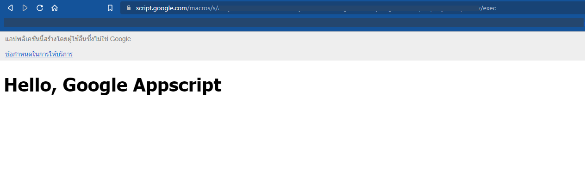

# การพัฒนาเว็บแอปด้วย Google Apps Script ร่วมกับ Google Sheet

## ขั้นตอน

* เตรียมชีตข้อมูล (Database)
* เปิดใช้งานโปรเจค Google Apps Script (GAS)
* เขียนโค้ด GAS, html
* เผยแพร่เว็บแอป
* นำเว็บแอปที่เผยแพร่แล้วไปใช้งาน

## เตรียมชีตข้อมูล (Database)

ผู้บันทึกได้สร้างแฟ้มข้อมูลในกูลเกิ้ลชีต ตั้งชื่อว่า `GAS Database Demo Sheets` โดยมีฟิลด์ข้อมูลคร่าว ๆ ไว้ดังรูป ผู้ศึกษาอาจทดลองสร้างตามแบบ หรือจะเปิดเป็นไฟล์ว่าง ๆ ไว้ก่อนก็ได้ เนื่องจากจะยังไม่เชื่อมต่อกับสคริปต์ในบทแนะนำนี้ แต่จะขอแนะนำไว้ก่อน เพราะจะค่อย ๆ แนะนำการพัฒนาสคริปต์ไปทีละขั้น จนสามารถใช้งานบันทึก เพิ่ม แก้ไข ลบ และอ่านข้อมูลในตารางได้จริง ในชีตข้อมูลนี้จะเป็นตารางสำหรับบันทึกข้อมูลลูกค้าเบื้องต้น

#### ฟิลด์ข้อมูล

* id ไว้สำหรับเก็บเลขทะเบียนการบันทึกข้อมูล
* CCode ก็คือรหัสลูกค้า (customer\_code)
* CName ชื่อลูกค้า/บริษัท, ห้าง, ร้าน (customer\_name)
* CAddress ที่อยู่ลูกค้า (customer\_address)
* CPhone หมายเลขโทรศัพท์ลูกค้า (customer\_phone)

<figure><figcaption></figcaption></figure>

## เปิดใช้งานโปรเจค Google Apps Script

เมื่อเตรียมชีตข้อมูลเรียบร้อยแล้ว ก็ได้เวลาสำหรับการเขียนสคริปต์ ทำการเปิดเข้าใช้งาน Google Apps Script Project โดยไปที่เมนู `ส่วนขยาย` แล้วเลือก `Apps Script`

<figure> ส่วนขยาย > Apps Script"><figcaption></figcaption></figure>

ระบบจะพาไปที่หน้า Apps Script Project ผู้บันทึกได้ทำการแก้ไขชื่อโปรเจคเป็น `GAS Database Demo` เพื่อให้สอดคล้องกับชีตข้อมูล เผื่ออนาคตสร้างชีตฐานข้อมูลอื่น ๆ มาใช้งานอีกจะได้ไม่สับสน :smile:

<figure><figcaption></figcaption></figure>

## เขียนโค้ด GAS, html

ขั้นต่อมาเป็นการเขียนโค้ด Apps Script ไปที่ไฟล์ `code.gs` หรือชื่อภาษาไทยว่า `โค้ด.gs` คืออันเดียวกัน จะเปลี่ยนให้เป็นภาษาอังกฤษก็ได้เพื่อความเรียบร้อย

ลบโค้ดเดิมที่มีอยู่ แล้วเขียนโค้ดนี้ลงไป

* **code.gs**

```javascript
function doGet(request) { 
    return HtmlService.createTemplateFromFile('index').evaluate(); 
}
```

<figure><figcaption></figcaption></figure>

ฟังชั่น **`doGet()`** เป็นข้อกำหนดที่ต้องใช้ หากมีการเผยแพร่สคริปต์เป็นเว็บแอป ในตัวอย่างจะทำงานเมื่อมีการส่งคําขอ HTTP `GET` ไปยังแอป โดยผู้ใช้งาน Apps Script ก็จะเรียกใช้ฟังก์ชัน **`doGet(request)`** โดยรับเอาพารามิเตอร์ `request` ที่ผู้ใช้ส่งเข้ามาในการประมวลคำสั่งว่าจะให้ทำอะไร จากนั้นจึงส่งกลับค่า (return) ออกไปเป็น Html Service ทาง index.html

* **index.html**

เพิ่มไฟล์ index.html เข้าในโปรเจค ในการทดสอบเราจะใช้โค้ดเริ่มต้น ที่โปรเจคสร้างให้อัตโนมัติโดยยังไม่ต้องไปแก้ไขอะไร แค่เพิ่มบรรทัดต่อไปนี้ ลงไปในส่วนแท็ก `<body> </body>` แบบนี้

```html
...
<body>
    <h1>Hello, Google Apps Script</h1>
</body>
...
```

<figure><figcaption></figcaption></figure>

เสร็จแล้วกดบันทึกเพื่อไปสู่ขั้นต่อไป

## นำเว็บแอปที่เผยแพร่แล้วไปใช้งาน

เมื่อพร้อมแล้ว เรามาทำการเผยแพร่สคริปต์ออกเป็นเว็บแอป เพื่อให้สามารถเข้าถึงได้ผ่านทางเว็บเพจ

#### ขั้นตอนการเผยแพร่เว็บแอป

* กดปุ่ม **`การทำให้ใช้งานได้`** ที่มุมขวาบนในหน้าต่างโปรเจค `Apps Script` เลือกหัวข้อ `การทำให้ใช้งานได้รายการใหม่`

<figure><figcaption></figcaption></figure>

* **การกำหนดค่า** เลือกประเภทเป็น **`เว็บแอป`**

<figure><figcaption></figcaption></figure>

* **กำหนดค่า** ดังนี้ `คำอธิบายใหม่` _(จะเปลี่ยนหรือไม่ก็ได้)_ ส่วน `ผู้มีสิทธิ์เข้าถึง` ให้เลือกเป็น **`ทุกคน`** เสร็จแล้วกดปุ่ม `การทำให้ใช้งานได้`

<figure>ผู้มีสิทธิ์เข้าถึง"><figcaption></figcaption></figure>

* กดปุ่ม **`ให้สิทธิ์เข้าถึง`** กดเลย

<figure><figcaption></figcaption></figure>

* **เลือกบัญชีอีเมลที่เป็นของเรา**

<figure><figcaption></figcaption></figure>

* เว็บจะเตือนว่า บัญชีอีเมลของเรากำลังจะเข้าถึงเว็บที่อาจมีความเสี่ยง กดปุ่ม **`Advanced`**

<figure><figcaption></figcaption></figure>

* กด `Go to <ชื่อโปรเจค> (unsafe)` เพื่ออนุญาตให้เข้าสู่เว็บที่อาจจะมีความเสี่ยงนี้ได้ (สคริปต์ของเราเองฉะนั้นหายห่วง)

<figure> (unsafe)"><figcaption></figcaption></figure>

* เว็บจะให้เรายืนยันสิทธิ์ในการเข้าถึงต่าง ๆ เหล่านี้ กด **`Allow`**

<figure><figcaption></figcaption></figure>

* จากนั้น เว็บจะสรุปให้ทราบว่า เราได้เผยแพร่เว็บแอปเป็นที่เรียบร้อย สังเกตจะเป็น `เวอร์ชั่น 1` กดปุ่มคัดลอก เพื่อนำลิงค์เว็บแอปของเราไปใช้ในการเข้าใช้งานเว็บ จากนั้นกดปุ่ม **`เสร็จสิ้น`** เป็นอันเสร็จ

<figure><figcaption></figcaption></figure>

* นำลิงค์ที่คัดลอกมาก่อนหน้านี้ ไปวางลงที่ช่อง Address ของบราวเซอร์ กด **`Enter`** ถ้าไม่ได้ทำขั้นตอนไหนผิดไป ก็จะต้องปรากฏหน้าเว็บ `Hello, Google Apps Script` ดังรูป :tada:

<figure><figcaption></figcaption></figure>

#### แสดงความคิดเห็นได้ที่ :point\_right: [](https://gist.github.com/Komsan74/8c31b037c0b3d497ec1e8a8df059cef5)

### แล้วจะใช้ประโยชน์อะไรจากเว็บแอป?&#x20;
