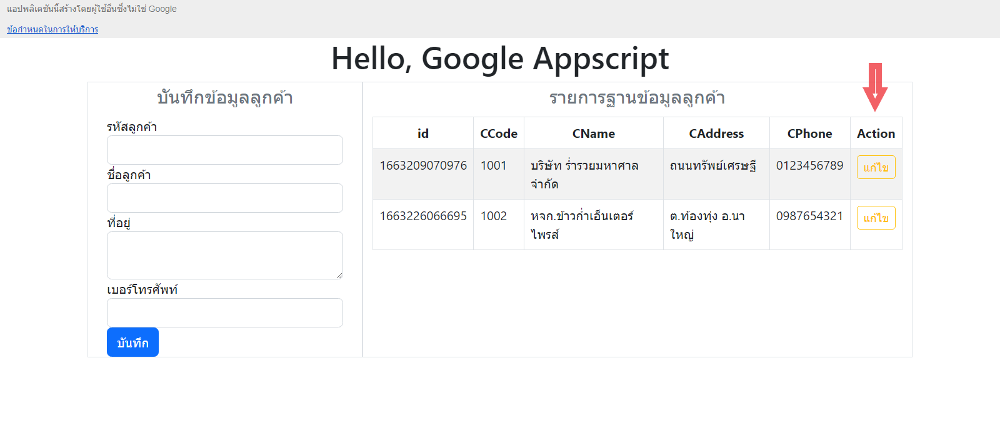

# แก้ไขข้อมูลกูลเกิ้ลชีตด้วยเว็บแอปผ่าน Google Apps Script



บทบันทึกนี้จะไม่อธิบายแบบลงรายละเอียดมากนัก เพราะส่วนใหญ่จะเป็นการแก้ไขสิ่งที่ได้ทำไว้แล้วจากบทบันทึกก่อนหน้า หากผู้ศึกษาเกิดข้อติดขัดหรือมีสิ่งใดสงสัย ให้ลองกลับไปทบทวนให้เข้าใจ ถ้าพร้อมแล้วก็มาลุยกันต่อได้เลย

## ขั้นตอน

### ส่วน Apps Script

* เพิ่มฟังก์ชั่น `updateData(data)` ส่งข้อมูลที่ได้รับจากไคลเอ็นต์ส่งเข้าไปแก้ไขข้อมูลในสเปรดชีต

### ส่วน HTML

* เพิ่มฟิลด์ข้อมูล ID ใน `form.html` แต่ให้ซ่อนการแสดงผลไว้ก่อน

### ส่วน CSS

* เพิ่มคลาส `.disabled` ปรับแต่งสีพื้นหลังและสีตัวอักษร

### ส่วน Javascript

* เพิ่มปุ่มแก้ไขข้อมูลในตาราง ด้วยการแก้ไขฟังก์ชั่น `getData(values)`
* เพิ่มฟังก์ชั่น `getTableRow(index)` ทำการดึงแถวข้อมูลจากตารางมาใส่ในฟอร์มบันทึกข้อมูล
* เพิ่มฟังก์ชั่น `saveEdit(data)` เพื่อส่งคำสั่งแก้ไขข้อมูลไปให้เซิร์ฟเวอร์

## ส่วน Apps Script

### เพิ่มฟังก์ชั่น `updateData(data)`

เปิดไฟล์ `code.gs` แล้วเพิ่มสคริปต์นี้ลงไป

```javascript
/***************  Update  ***************/
function updateData(data){
  let last_row = worksheet.getLastRow();
  let last_col = worksheet.getLastColumn();
  
  let values = [];
  values.push([data.id, data.ccode, data.cname, data.caddress, data.cphone]);  
  
  // กำหนดช่วงแถวข้อมูลเพื่อค้นหาแถวที่ต้องการแก้ไข
  for(let i = 2; i <= last_row; i++) {  
    // หาแถวที่ต้องการแก้ไขจาก id ซึ่งอยู่ในคอมลัมน์ที่ 1
    if(worksheet.getRange(i,1).getValue() == data.id) {
      // เปลี่ยนข้อมูลในแถวที่มีค่าในคอลัมน์ตรงกับค่า id ที่ต้องการแก้ไข
      worksheet.getRange(i, 1, 1, last_col).setValues(values);     
    }    
  }
  
  let result = "แก้ไขข้อมูลสำเร็จ";
  return result;
}
```

หากสังเกตให้ดี จะเห็นว่ามีความคล้ายกับฟังก์ชั่น `createData(data)` อยู่มาก ต่างกันก็เพียงฟังก์ชั่นนี้จะมีการค้นหา `แถวข้อมูล` ที่ต้องการแก้ไข จากหมายเลขไอดี ที่ส่งมาจากฝั่งไคลเอ็นต์ `data.id` ซึ่งจะไม่ซ้ำกันอยู่แล้ว เนื่องจากเราสร้างหมายเลขไอดีขึ้นมาจาก วันเดือนปีและเวลาที่บันทึกข้อมูลนั่นเอง ไม่มีทางที่แถวข้อมูลจะถูกบันทึกหมายเลขเดียวกันได้ จากคำอธิบายสั้น ๆ ที่คอมเม้นต์ไว้ในสคริปต์ ก็น่าจะพอทำความเข้าใจได้แล้ว

## ส่วน HTML

### เพิ่มฟิลด์ข้อมูล ID ใน `form.html`

เปิดไฟล์ `form.html` แล้วเพิ่มสคริปต์นี้ลงไป ถัดจากแท็ก `<legend>`

```html
<!-- Form Name -->
<legend class="text-secondary text-center">บันทึกข้อมูลลูกค้า</legend>

<!-- Text input ID Field (display: none) -->
<div id="divId" class="form-group" style="display: none">    
  <div class="col-md">
    <label class="control-label" for="ccode">ID</label>
    <input id="id" name="id" type="text" placeholder="" class="form-control input-md disabled" readonly="readonly">
  </div>
</div>
```

### ส่วนสำคัญที่จะนำไปอ้างอิงในส่วนของ `javascript` และ `css`

* div id="divId" ชื่อไอดีของ Element ที่เราเพิ่มเข้ามาในฟอร์ม จะเห็นว่ามีการใส่ `style="display: none"` เพื่อซ่อนไม่ให้มีการแสดงผลออกมา
* input id="id" ชื่อไอดีของฟิลด์แสดงผลหมายเลขไอดีลูกค้า
* class="disabled" คลาสที่เพิ่มเข้ามาเพื่อกำหนดสีพื้นหลังให้กับฟิลด์ข้อมูลด้วย `css`
* readonly="readonly" กำหนดให้ฟิลด์ข้อมูลนี้อ่านได้อย่างเดียวไม่สามารถแก้ไขได้

## ส่วน CSS

### เพิ่มคลาส `.disabled` ปรับแต่งสีพื้นหลังและสีตัวอักษร

เปิดไฟล์ `css.html` แล้วเพิ่มสคริปต์นี้ลงไปในส่วน `Custom CSS` ภายในแท็ก `<style>`

```css
<!-- Custom CSS -->
<style>
.disabled{
  pointer-events: none;
  background: #f5f5f5;
  color: #a9a9a9;
}
</style>
```

สีพืนหลัง `(background)` กับสีฟอนต์ `(color)` ผู้บันทึกคิดว่าน่าจะเข้ากับสถานการณ์แบบนี้ ถ้าผู้ศึกษาไม่ชอบใจก็อาจเปลี่ยนเป็นโค้ดสีที่ชอบได้ตามสมควร

## ส่วน Javascript

### เพิ่มปุ่มแก้ไขข้อมูลในตาราง ด้วยการแก้ไขฟังก์ชั่น `getData(values)`

เปิดไฟล์ `javascript.html` มองหาฟังก์ชั่น `getData(values)` (ในหัวข้อ \*\* READ \*\* ) แล้วแก้ไขสคริปต์ให้เป็นดังนี้

```javascript
function getData(values) {      
  let json = JSON.parse(values);
  // <table>
  var table = document.createElement("table");
  table.setAttribute("class", "table table-striped table-bordered");
  table.setAttribute("id", "table");  
  // <thead>
  let header = table.createTHead();  
  header.setAttribute("class", "text-center");
  // <tr>
  let row = header.insertRow(0);    
  // <th>
  let headerCell = json.sheets[0]; 
  for (let th in headerCell){      
    row.insertCell().innerHTML = `<b> ${headerCell[th]} </b>`;
  }
  // เพิ่ม column header 'Action' ไว้ท้ายแถว <<<<<<<<<<<<<<<<<<<<<<<<<<<<<<<<<<<<<<<<<< 1.
  row.insertCell().innerHTML = `<b>Action</b>` // ใช้เครื่องหมาย ` ไม่ใช่ ' นะ

  // <tbody>
  let tbody = table.createTBody();
  // <tr>
  let tr;
  for (let i = 1; i < json.sheets.length; i++) {
    tr = tbody.insertRow();
    tr.setAttribute('id', i)
    // <td>      
    for (let td in json.sheets[i]) {          
      tr.insertCell().innerHTML = json.sheets[i][td];
    }
    // เพิ่มปุ่มสำหรับ [แก้ไข] ที่คอลัมน์ Action ของแต่ละแถว <<<<<<<<<<<<<<<<<<<<<<<<<<<<<<<<<<<<<<<<<< 2.
    tr.insertCell().innerHTML = `
        <button type="button" class="btn btn-outline-warning btn-sm" onclick="getTableRow(${i})">แก้ไข</button>        
        `; // <<< เครื่องหมาย ` พิมพ์โดยกด ALT ค้างไว้ แล้วกด 9 6 <<<
  }    

  var showData = document.getElementById("showData");
  showData.innerHTML = "";
  showData.appendChild(table);     
}
```

มีเพิ่มเข้ามา 2 จุด คือคอลัมน์ Action และปุ่ม `แก้ไข` ในแต่ละแถว ใส่เหตุการณ์ `onclick="getTableRow(${i})"` ไว้จับเหตุการณ์เมื่อผู้ใช้งานคลิกที่ปุ่ม ให้สั่งฟังก์ชั่น `getTableRow(แถวข้อมูลของปุ่มนั้น)` ทำงาน

### เพิ่มฟังก์ชั่น `getTableRow(index)` ทำการดึงแถวข้อมูลจากตารางมาใส่ในฟอร์มบันทึกข้อมูล

ไฟล์ `javascript.html` สร้างฟังชั่น `getTableRow(index)` เพิ่มเข้ามาดังนี้

```javascript
/*****************  UPDATE  ********************/
function getTableRow(index) { 
  let data_row = document.getElementById("table").rows[index].cells;
  let values = [];
  for (let i = 0; i < data_row.length - 1; i++) {
    values.push(data_row.item(i).innerHTML);  
  }

  // populate values to form    
  let forms = document.getElementById('form-customer');   
  forms.setAttribute("onsubmit", "saveEdit(this)") 

  document.getElementById('divId').style.display = "block";

  forms.elements['id'].value = values[0];
  forms.elements['ccode'].value = values[1];
  forms.elements['cname'].value = values[2];
  forms.elements['caddress'].value = values[3];
  forms.elements['cphone'].value = values[4];

  forms.elements['btn-submit'].setAttribute("class", "btn btn-warning");    
}
```

เมื่อผู้ใช้เว็บแอปคลิกที่ปุ่ม `แก้ไข` ในขณะที่เราสร้างปุ่มจากฟังก์ชั่น `getData()` แต่ละปุ่มจะกำหนดหมายเลข `index` ของแถวเอาไว้เรียบร้อยแล้ว จาก `${i}` ฉะนั้นฟังก์ชั่น `getTableRow(index)` จึงทำงานได้ทันที

* สร้างตัวแปร values\[] เป็นอาร์เรย์มารับค่าจากแถวข้อมูลในตาราง  วนลูปแถวข้อมูลเพื่อรับค่าไว้ในอาร์เรย์

```
values.push(data_row.item(i).innerHTML);
```

* กำหนดค่า `onsubmit` ของฟอร์มใหม่ เปลี่ยนจาก `handleFormSubmit(this)` เป็น `saveEdit(this)`&#x20;

```
forms.setAttribute("onsubmit", "saveEdit(this)")
```

* แสดง Element ที่ซ่อนไว้ในฟอร์ม&#x20;

```
document.getElementById('divId').style.display = "block";
```

* นำค่าที่เก็บไว้ในอาร์เรย์มาใส่ในฟอร์ม&#x20;

```
forms.elements[element_id].value = values[array_index];
```

* เปลี่ยนสีที่ปุ่ม `บันทึก` เป็นสีเหลืองเพื่อให้ผู้ใช้ทราบว่าขณะนี้กำลังอยู่ในโหมดแก้ไขข้อมูล

### เพิ่มฟังก์ชั่น `saveEdit(data)` เพื่อส่งคำสั่งแก้ไขข้อมูลไปให้เซิร์ฟเวอร์

ไฟล์ `javascript.html` เพิ่มฟังก์ชั่น `saveEdit(data)` เพื่อกระทำคำสั่ง `onsubmit` จากฟอร์ม

```javascript
function saveEdit(data) {      
  google.script.run.withSuccessHandler(goAlert).updateData(data);

  document.getElementById("divId").style.display = "none";
  document.getElementById("btn-submit").setAttribute("class", "btn btn-primary");
  document.getElementById("form-customer").setAttribute("onsubmit", "handleFormSubmit(this)");
  document.getElementById("form-customer").reset();  
}
```

* ติดต่อกับเซิร์ฟเวอร์ให้ดำเนินการคำสั่ง `updateData(data)`
* เมื่อได้รับการตอบกลับให้ดำเนินคำสั่ง `goAlert()` ซึ่งเราสร้างไว้จากบทบันทึกก่อนหน้านี้ไปแล้ว
* ปรับฟอร์มให้เป็นโหมดเริ่มต้น ซ่อน Element divId ไว้เหมือนเดิม&#x20;

```
document.getElementById("divId").style.display = "none";
```

* เปลี่ยนสีที่ปุ่ม `บันทึก` ให้กลับมาโหมดเริ่มต้น คือเป็นสีน้ำเงินเหมือนเดิม&#x20;

```
document.getElementById("btn-submit").setAttribute("class", "btn btn-primary");
```

* เปลี่ยนฟังก์ชั่น `onsubmit` ให้เป็นค่าเริ่มต้น&#x20;

```
document.getElementById("form-customer").setAttribute("onsubmit", "handleFormSubmit(this)");
```

* เคลียร์ข้อมูลต่าง ๆ ที่อยู่ในฟอร์ม&#x20;

```
document.getElementById("form-customer").reset();
```

เสร็จแล้วลองทดสอบแก้ไขข้อมูลดู

* กด แก้ไข ในตัวอย่าง เลือกแถวข้อมูล "หจก.ข้าวก่ำเอ็นเตอร์ไพรส์"&#x20;

<figure><figcaption></figcaption></figure>

* รายการที่อยู่ในแถวข้อมูล จะถูกส่งไปที่ฟอร์ม ปุ่มบันทึกจะเปลี่ยนเป็นสีเหลือง

<figure><figcaption></figcaption></figure>

* ลองแก้ไขที่อยู่ จาก "ต.ท้องทุ่ง อ.นาใน" เปลี่ยนเป็น "โคกหนองนาโมเดล" กดปุ่มบันทึก&#x20;

<figure><figcaption></figcaption></figure>

* จะปรากฏกล่องแจ้งเตือน กด `ตกลง`

<figure><figcaption></figcaption></figure>

* ฟอร์มจะกลับสู่โหมดเริ่มต้น และตารางก็จะแสดงข้อมูลที่ได้รับการแก้ไขเรียบร้อยแล้ว&#x20;

<figure><figcaption></figcaption></figure>

ก็เป็นอันว่าเสร็จเรียบร้อยแล้วสำหรับการแก้ไขข้อมูลในกูลเกิ้ลชีตด้วยเว็บแอปผ่าน Google Apps Script หวังเป็นอย่างยิ่งว่าผู้ศึกษาคงได้รับประโยชน์จากบทบันทึกนี้ ในการนำไปต่อยอดพัฒนาระบบใช้งานในหน่วยงานของผู้ศึกษาต่อไป

### แสดงความคิดเห็นได้ที่ :point\_right: [](https://gist.github.com/Komsan74/7afd528217e733bbfda18e8c299166ea)

## แล้วถ้ามีข้อมูลที่ไม่ต้องการอยู่ในฐานข้อมูลล่ะ? :man\_shrugging:
