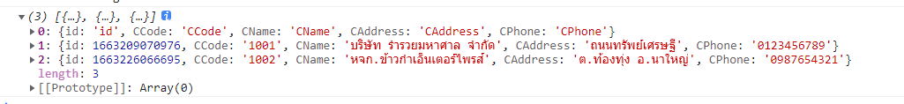
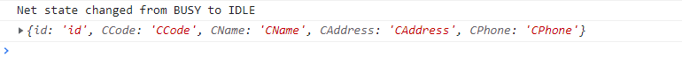

# อ่านข้อมูลจากกูลเกิ้ลชีตแล้วนำมาแสดงผลที่เว็บแอปด้วย Google Apps Script

## ขั้นตอน

* เขียนฟังก์ชั่น Apps Script อ่านข้อมูลจากกูลเกิ้ลชีต
* เขียนฟังก์ชั่น Javascript ขอข้อมูลจากเซิร์ฟเวอร์และนำมาแสดงผลลงในตาราง

## เขียนฟังก์ชั่น Apps Script อ่านข้อมูลจากกูลเกิ้ลชีต

### สิ่งที่ต้องรู้

* SHEET\_ID หมายเลขไอดีของสเปรดชีต (ใช้สเปรดชีตอันเดิมจากบทบันทึกที่แล้ว)
* SHEET\_NAME ชื่อแผ่นงาน (ใช้แผ่นงานเดิมจากบทบันทึกที่แล้ว)
* HeaderRow แถวของข้อมูลที่เราจะนำมาเป็นส่วนหัวของตาราง
* DataRows แถวของข้อมูลทั้งหมดในแผ่นงาน (Database)

จากบทบันทึกที่แล้ว เราได้ประกาศ SHEET\_ID และ SHEET\_NAME ไว้แล้ว ดังนั้นจะขอข้ามส่วนนี้ไป

### HeaderRow

แถวของข้อมูลที่เราจะนำมาเป็นส่วนหัวของตาราง ก็คือ Column Header ในสเปรดชีตตัวอย่างมีอยู่ 5 คอลัมน์ คือ

|  #  |  A  |   B   |   C   |     D    |    E   |
| :-: | :-: | :---: | :---: | :------: | :----: |
|  1  |  id | CCode | CName | CAdrress | CPhone |

เมื่อพิจารณาแล้วว่า ส่วนหัวคอลัมน์อยู่ในแถวที่ 1 ของสเปรดชีต โดยเริ่มจากคอลัมน์ที่ 1 ไปจนถึงคอลัมน์ที่ 5 ของสเปรดชีต ทำให้เราสามารถใช้ฟังก์ชั่น `.getRange(แถวที่, คอลัมน์ที่, จำนวนแถว, จำนวนคอลัมน์).getValues()` ดึงข้อมูลส่วนหัวออกมาใช้งานได้

### แทรก Apps Script นี้ลงไปที่ code.gs

```javascript
function getHeaderRow_() {   
  return worksheet.getRange(1, 1, 1, worksheet.getLastColumn()).getValues()[0];
}
```

### DataRows

แถวของข้อมูลทั้งหมดในแผ่นงาน (Database) ในสเปรดชีตตัวอย่าง เราเริ่มทำการบันทึกข้อมูลลงในแผ่นงาน (รวมส่วนหัว) ตั้งแต่แถวที่ 1 ลงไป

|  #  |    A   |    B   |    C   |    D   |    E   |
| :-: | :----: | :----: | :----: | :----: | :----: |
|  1  | Header | Header | Header | Header | Header |
|  2  |  Data  |  Data  |  Data  |  Data  |  Data  |
|  3  |   ...  |   ...  |   ...  |   ...  |   ...  |

เมื่อพิจารณาจากหลักฐานที่ได้ เอ๊ย! จากข้อมูลที่มี :innocent: เราเริ่มบันทึกข้อมูลจากแถวที่ 1 เริ่มจากคอลัมน์ที่ 1 จนถึงแถวคอลัมน์สุดท้ายที่มีข้อมูล เราจึงยังใช้ฟังก์ชั่น `.getRange(แถวที่, คอลัมน์ที่, จำนวนแถว, จำนวนคอลัมน์).getValues()` มากำหนดช่วงสำหรับดึงข้อมูลเช่นเดิม

### แทรก Apps Script นี้ลงไปที่ code.gs

```javascript
function getDataRows_() {
  return worksheet.getRange(1, 1, worksheet.getLastRow(), worksheet.getLastColumn()).getValues();
}
```

### แปลงข้อมูลเป็น JSON

ฟังก์ชั่น `getHeaderRow_()` และฟังก์ชั่น `getDataRows_` ข้างต้น จะได้ข้อมูลออกมาเป็นรูปแบบอาร์เรย์

* getHeaderRow\_() เป็นอาร์เรย์ 1 มิติ (Vector) \[id, CCode, CName, CAddress, CPhone]
* getDataRows\_() เป็นอาร์เรย์ 2 มิติ (Matrix) \[\[id, CCode, CName, CAddress, CPhone],\[อาร์เรย์แถวข้อมูล],\[...]]

เราจะทำการรวมข้อมูลที่ได้มาให้เป็นออปเจ็คอาร์เรย์เพื่อแปลงข้อมูลที่จะส่งออกไปหาไคลเอ็นต์ให้เป็นรูปแบบ JSON แบบว่า `{"name", "value"}` โดยให้ข้อมูลที่ได้จาก getHeaderRow\_() เป็น keyname และข้อมูลจาก getDataRows\_() เป็น keyvalue

### แทรก Apps Script นี้ลงไปที่ code.gs

```javascript
function readData_(keyname) {
  // ป้องกัน keyname มีเว้นวรรคให้แทนที่ด้วย _ (underscore)
  if (typeof keyname == "undefined") {
    keyname = getHeaderRow_();
    keyname = keyname.map(function(p) { return p.replace(/\s+/g, '_'); });
  } 

  var keyvalue = getDataRows_(),
      data = [];

  for (let r in keyvalue) {
    var row     = keyvalue[r],
        record  = {}; 

    for (let p in keyname) {
      record[keyname[p]] = row[p]; 
    }
  
    data.push(record);
  }
  
  return data;
}
```

เมื่อลองใช้ฟังก์ชั่น `Logger.log(data)` ออกมาดู ก็จะเห็นว่าข้อมูลที่จัดเตรียมออกมาเป็นแบบนี้

```javascript
[
  {CAddress=CAddress, id=id, CCode=CCode, CPhone=CPhone, CName=CName}, 
  {CPhone=0123456789, CAddress=ถนนทรัพย์เศรษฐี, id=1.663209070976E12, CName=บริษัท ร่ำรวยมหาศาล จำกัด, CCode=1001}, 
  {CAddress=ต.ท้องทุ่ง อ.นาใหญ่, CName=หจก.ข้าวก่ำเอ็นเตอร์ไพรส์, CPhone=0987654321, id=1.663226066695E12, CCode=1002}
]
```

ยังคงเป็นออปเจ็คอาร์เรย์ที่มีข้อมูลแบบข้อความธรรมดา ๆ หากจะนำข้อมูลแบบนี้ไปใช้งานก็คงยุ่งยากไม่น้อย ฉะนั้น ก่อนที่จะส่งออกไปให้กับไคลเอ็นต์ จึงควรทำให้อยู่ในรูปแบบ JSON โดยสมบูรณ์

### แทรก Apps Script นี้ลงไปที่ code.gs

```javascript
function readData() {
  let data = {};  
  data.sheets = readData_();
  
  return JSON.stringify(data);
};
```

แบบนี้ถ้าใช้ฟังก์ชั่น Logger.log(JSON.stringify(data)) ก็จะได้ผลลัพท์ออกมาแบบนี้

```json
{"sheets":[
    {"id":"id","CCode":"CCode","CName":"CName","CAddress":"CAddress","CPhone":"CPhone"},
    {"id":1663209070976,"CCode":"1001","CName":"บริษัท ร่ำรวยมหาศาล จำกัด","CAddress":"ถนนทรัพย์เศรษฐี","CPhone":"0123456789"},
    {"id":1663226066695,"CCode":"1002","CName":"หจก.ข้าวก่ำเอ็นเตอร์ไพรส์","CAddress":"ต.ท้องทุ่ง อ.นาใหญ่","CPhone":"0987654321"}
  ]
}
```

ใช่! รูปแบบถูกต้องพร้อมใช้งานแล้ว จะเห็นว่าเราสร้างฟังก์ชั่น Apps Script ขึ้นมาทั้งหมด 4 ฟังก์ชั่นด้วยกัน ซึ่งถ้าสังเกตจะเห็นว่าผู้บันทึกใส่เครื่องหมาย \_ (underscore) ต่อท้ายชื่อฟังก์ชั่นเอาไว้ เหลือแค่ฟังก์ชั่น `readData()` แค่ฟังก์ชั่นเดียว ที่เป็นอย่างนั้นก็เพราะว่า ไม่ต้องการเปิดเผยฟังก์ชั่นเหล่านั้น ให้มองเห็นจากฝั่งไคลเอ็นต์ได้ `Google Apps Script` จะถือว่าฟังก์ชั่นที่ลงท้ายด้วยขีดล่างเป็นฟังก์ชั่นส่วนตัว

## สรุป Google Apps Script ทั้งหมดที่เพิ่มใน `code.gs`

```javascript
/***************  Read   ***************/
function readData() {
  let data = {};  
  data.sheets = readData_();
  
  return JSON.stringify(data);
};

function readData_(keyname) {
  // ป้องกัน keyname มีเว้นวรรคให้แทนที่ด้วย _ (underscore)
  if (typeof keyname == "undefined") {
    keyname = getHeaderRow_();
    keyname = keyname.map(function(p) { return p.replace(/\s+/g, '_'); });
  } 

  let keyvalue = getDataRows_(),
      data = [];

  for (let r in keyvalue) {
    let row     = keyvalue[r],
        record  = {}; 

    for (let p in keyname) {
      record[keyname[p]] = row[p]; 
    }
  
    data.push(record);
  }
  return data;
}

function getHeaderRow_() {   
  return worksheet.getRange(1, 1, 1, worksheet.getLastColumn()).getValues()[0];
}

function getDataRows_() {
  return worksheet.getRange(1, 1, worksheet.getLastRow(), worksheet.getLastColumn()).getValues();
}
```

## เขียนฟังก์ชั่น Javascript ขอข้อมูลจากเซิร์ฟเวอร์และนำมาแสดงผลลงในตาราง

### สิ่งที่ต้องรู้

* คำสั่งสำหรับอ่านข้อมูลฝั่งเซิร์ฟเวอร์
* ส่วนหัวของข้อมูล
* รายการข้อมูลทั้งหมด
* สร้างตารางแสดงข้อมูลออกทางเว็บแอป

### คำสั่งสำหรับอ่านข้อมูลฝั่งเซิร์ฟเวอร์

จากหัวข้อที่แล้ว คำสั่งสำหรับอ่านข้อมูลจากเซิร์ฟเวอร์ที่ไคลเอ็นต์มองเห็นจะมีแค่ `readData()` ฉะนั้นเมื่ออยู่ที่ฝั่งไคลเอ็นต์เราสามารถใช้คำสั่ง

```javascript
google.script.run.withSuccessHandler(function).readData(); 
```

เพื่อขอข้อมูลในกูลเกิ้ลชีตกับเซิร์ฟเวอร์ได้ ซึ่งจะได้รับข้อมูลตอบกลับมาเป็นข้อความ JSON ตามที่สคริปต์ฝั่งเซิร์ฟเวอร์ได้กำหนดไว้

### ส่วนหัวของข้อมูล

### แก้ไข javascript.html เพิ่มฟังก์ชั่นนี้ลงไป

```javascript
google.script.run.withSuccessHandler(getData).readData();  
function getData(values) {      
  let json = JSON.parse(values);
  console.log(json);
} 
```

ทำการทดสอบเว็บแอป ตามขั้นตอนที่เคยแนะนำไว้ใน [ทดสอบเว็บแอป](https://kms74.gitbook.io/learn-to-be/google-apps-script/form-insert-data-to-google-sheet#undefined-2) จากบทบันทึกที่แล้ว กด `F12` ดูในส่วนของหน้าต่างคอนโซล จะเห็นว่าเว็บแอปของเราได้รับข้อมูล JSON ที่ส่งมาจากเซิร์ฟเวอร์ใส่ไว้ในตัวแปร json แล้ว

<figure><figcaption></figcaption></figure>

ทีนี้เรามาคัดเอาเฉพาะส่วนหัว จะเห็นว่าส่วนหัวที่เราต้องการอยู่ที่ index\[0] โดยชื่อออปเจ็คที่ส่งมาจากเซิร์ฟเวอร์คือ `sheets` ดังนั้นเรามาเพิ่มโค้ดเข้าไปที่ฟังก์ชั่น `getData()` ก่อนบรรทัดที่พิมพ์ว่า console.log(json)

```javascript
let headerCell = json.sheets[0]
```

กด refresh เว็บแอปอีกครั้ง ดูที่หน้าต่างคอนโซลจะเห็นว่าเหลือเฉพาะข้อมูลที่เป็นส่วนหัวคอลัมน์แล้ว

<figure><figcaption></figcaption></figure>

### รายการข้อมูลทั้งหมด

จากโค้ดในหัวข้อที่แล้ว ตัวแปร json ได้เก็บข้อมูลทั้งหมดในกูลเกิ้ลชีตที่ส่งมาจากเซิร์ฟเวอร์ไว้แล้ว และได้แยก index\[0] ออกไปเป็นส่วนหัวคอลัมน์ ดังนั้นข้อมูลตั้งแต่ index\[1] เป็นต้นไปจึงเป็นรายการข้อมูลส่วนเนื้อหาที่เราต้องการ สามารถวางแผนสคริปต์ได้ดังนี้

```javascript
for (let i = 1; i < json.sheets.length; i++) {
  // json.sheets[i] วนลูปออปเจ็ค sheets[1] จนถึง sheets[ลำดับสุดท้าย]
}
```

เพราะเรารู้ว่าออปเจ็ค sheets\[] เป็นออปเจ็คอาร์เรย์ 2 มิติ ดังนั้นเราสามารถแก้ไขสคริปต์ด้านบน เพื่อวนลูปเอาข้อมูลออกมาได้ทั้ง 2 มิติ แบบนี้

```javascript
for (let i = 1; i < json.sheets.length; i++) {
  // json.sheets[i] วนลูปออปเจ็ค sheets[1] จนถึง sheets[ลำดับสุดท้าย]
  for (let td in json.sheet[i]) {
    // json.sheets[i][td] วนลูปภายในออปเจ็ค sheets[i] เพื่อแสดงข้อมูล
  }
}
```

## สร้างตารางแสดงข้อมูลออกทางเว็บแอป

### โครงสร้างของตาราง `html` จะเป็นดังนี้

```html
<table>
  <thead>
    <tr>
      <th>หัวคอลัมน์</th>
    </tr>
  </thead>
  <tbody>
    <tr>
      <td>ฟิลด์ข้อมูล</td>
    </tr>    
    <tr>
      ...
    </tr>
    ...
  </tbody>
</table>
```

เราจะใช้คำสั่ง Javascript สร้างตารางข้อมูลขึ้นมา แล้วนำไปวางไว้ใน `Element` หนึ่งในหน้าเว็บแอป ใช้ชื่อ `id` ว่า `showData`

## เพิ่มไฟล์ `.html` ใหม่ชื่อ `showData.html` พิมพ์โค้ดตามนี้

```html
<legend class="text-center text-secondary">รายการฐานข้อมูลลูกค้า</legend>          
<div id="showData" />
```

## แก้ไขไฟล์ `idex.html` ทำการ include(showData) เข้าไปถัดจาก Element `form`

```html
<div class="row">
  <div class="col-4 border">
    <?!= include('form'); ?>  
  </div>

  <div class="col-8 border">
    <?!= include('showData'); ?>
  </div>       
</div>
```

กดบันทึกแล้วไปหน้าทดสอบเว็บแอป กด `F5` จะเห็นป้ายข้อความ "รายการฐานข้อมูลลูกค้า" ปรากฏขึ้นเป็นอันถูกต้อง

## สร้างตารางข้อมูลด้วย Javascript

เมื่อรู้ส่วนประกอบของตารางข้อมูลแล้ว ต่อไปมาทำความรู้จักกับคำสั่งที่จะใช้สร้างส่วนประกอบเหล่านั้นขึ้นมา

* `<table>` ใช้คำสั่ง `document.createElement("table")`
* `<thead>` ใช้ฟังก์ชั่น `.createTHead()`
* `<tr>` ในส่วนของ ใช้ฟังก์ชั่น `<thead>.insertRow()`
* `<th>` ใช้ฟังก์ชั่น `<thead.tr>.insertCell()`
* `<tbody>` ใช้ฟังก์ชั่น `.createTBody()`
* `<tr>` ในส่วนของ ใช้ฟังชั่น `<tbody>.insertRow()`
* `<td>` ใช้ฟังก์ชั่น `<tbody.tr>.insertCell()`
* การนำไปแสดงผลใน Element ที่กำหนด ใช้ฟังก์ชัน `document.getElementById(elemen_id).appendChild(table)`

รู้จักคำสั่งแล้วก็ลงมือเขียนสคริปต์คำสั่งโดยรวบรวมปัจจัยทั้งหมดข้างต้นเข้าด้วยกัน

## แก้ไขไฟล์ `javascript.html` เพิ่มส่วนโค้ดทั้งหมดนี้ลงไป

```javascript
<script>
  ...
  ฟังก์ชั่นเดิมที่มีอยู่แล้ว
  ...
  
  /*****************  READ  ********************/
  google.script.run.withSuccessHandler(getData).readData();  
  function getData(values) {      
    let json = JSON.parse(values);
    // <table>
    var table = document.createElement("table");
    table.setAttribute("class", "table table-striped table-bordered");    
    // <thead>
    let header = table.createTHead();  
    header.setAttribute("class", "text-center");
    // <tr>
    let row = header.insertRow(0);    
    // <th>
    let headerCell = json.sheets[0]; 
    for (let th in headerCell){      
      row.insertCell().innerHTML = `<b> ${headerCell[th]} </b>`;
    }
    
    // <tbody>
    let tbody = table.createTBody();
    // <tr>
    let tr;
    for (let i = 1; i < json.sheets.length; i++) {
      tr = tbody.insertRow();
      // <td>      
      for (let td in json.sheets[i]) {          
        tr.insertCell().innerHTML = json.sheets[i][td];console.log(json.sheets[i][td]);
      } 
    }

    var showData = document.getElementById("showData");
    showData.innerHTML = "";
    showData.appendChild(table);     
  } 

</script>
```

กดบันทึกแล้วไปหน้าทดสอบเว็บแอป กด `F5` ถัดจากป้ายข้อความ "รายการฐานข้อมูลลูกค้า" ควรจะแสดงตารางที่มีข้อมูลเหมือนกับในสเปรดชีตของเราแบบเป๊ะ ๆ ถ้าไม่ขึ้นแสดงว่าคงมีส่วนที่ผู้ศึกษาพลาดไป (เพราะผู้บันทึกย่อมไม่ผิด) ฮา :smile:

<figure><figcaption></figcaption></figure>

หากพบข้อผิดพลาดหรือต้องการให้คำแนะนำเพิ่มเติม ผู้บันทึกยินดีน้อมรับเพื่อนำมาปรับปรุงแก้ไขบทบันทึกให้ดียิ่งขึ้น

#### แสดงความคิดเห็นได้ที่ :point\_right: [gist page](https://gist.github.com/Komsan74/8d04fa09c360c9b8386d3e47d4b6960e) :pray:

## แล้วถ้ามีการบันทึกข้อมูลผิดล่ะ? :man\_shrugging:
