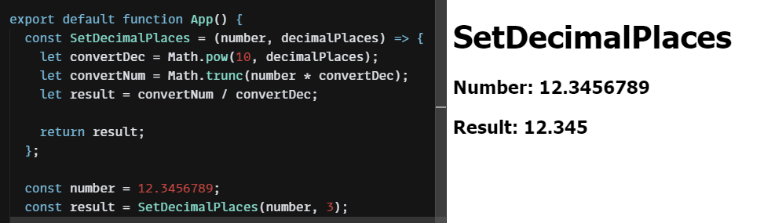

# การตัดหลักทศนิยมโดยไม่ปัดเศษ

การตัดหลักทศนิยมใน React (Javascript) นั้น ย่อมเป็นที่รู้กันว่ามีมากมายหลายวิธี อย่างเป็นที่นิยมก็คงหลีกไม่พ้น `number.toFixed() เพราะง่ายและสะดวกดี`


แต่ก็มีปัญหาอย่างหนึ่งที่พบประจำ ก็คือเลขทศนิยมที่ได้มานั้น จะถูกปัดเศษขึ้นหรือลง แล้วแต่ว่าเศษตัวสุดท้ายของหลักนั้นจะเป็นเลขอะไร แล้วถ้าเราไม่ต้องการให้มันปัดเศษล่ะ?


## วิธีการ

* เปลี่ยนจำนวนหลักทศนิยมให้เป็นจำนวนเต็ม

```javascript
Math.pow(10, decimalPlaces);
```

* ทำการแปลงเลขทศนิยมที่จะนำมาตัดให้เป็นเลขจำนวนเต็มแบบไม่ปัดเศษ

```javascript
Math.trunc(number * จำนวนเต็มหลักทศนิยม)
```

* จากนั้นก็ทำการแปลงจำนวนเต็มกลับไปเป็นทศนิยมตามเดิม

```javascript
จำนวนที่แปลงแล้ว / จำนวนเต็มหลักทศนิยม
```

## เขียนโค้ด

จากวิธีการที่ว่ามาข้างต้น เราจึงสรุปออกมาเป็นฟังชั่นง่าย ๆ แบบนี้

```javascript
const SetDecimalPlaces = (number, decimalPlaces) => {
  let convertDec = Math.pow(10, decimalPlaces);
  let convertNum = Math.trunc(number * convertDec);

  let result = convertNum / convertDec;
  return result;
};
```

หรือจะเขียนให้สั้นขึ้นอีก (แต่อาจจะดูยุ่งเหยิงอยู่บ้าง หากจำเป็นต้องกลับมาไล่แก้ไขภายหลัง)

```javascript
const SetDecimalPlaces = (n, d) => (Math.trunc(n * Math.pow(10, d))/Math.pow(10, d))
```

ทั้งสองแบบให้ผลลัพท์เหมือนกัน&#x20;

<figure><figcaption></figcaption></figure>

## นำไปใช้งาน

```javascript
SetDecimalPlaces(12.3456789, 3); // 12.345
```

## อ้างอิง

* [Demo in codesanbox.io](https://codesandbox.io/s/setdecimalplaces-2qdwxp)

